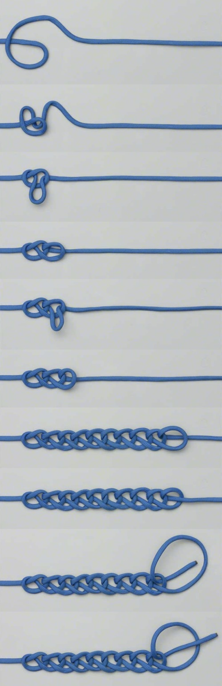

**The daisy chain: meaning without foundation**

We imagine ourselves as carrying meaning forward through time, gathering it from experience like a traveler collecting provisions for a journey. We believe the world has already been interpreted, that significance inheres in things themselves, and that memory merely stores what was discovered there. But direct inspection reveals something stranger.

Firstly, note that experience never once occurred outside this present moment. The past is not encountered directly; it appears only as memory arising now. And meaning itself depends upon this continual reappearance. The sense that something matters, that something is about something else, relies upon retention — the carrying forward of distinctions and associations from one moment into another. Without this recursive movement of memory, the world ceases to present itself as meaningful in the familiar sense.

But if the grip loosens even briefly, this becomes visible. One sees that the bare moment contains no intrinsic declaration:
*this is important,
this is you,
this is your life,
this is what things mean.*

There is still seeing. Still sound. Still sensation. But the interpretive overlay is gone, and with its absence so too the felt solidity of the world one thought oneself to inhabit.

Yet memory cannot ground itself either. Every meaning refers backward to prior meanings in an endless chain of inherited distinctions. At some point there must have been a beginning to memory, a first stabilization of significance that itself possessed no prior significance to justify it, no? How can something recursively sustained not start with an intrinsic ... something? But before there was the idea of "you", where did it come from? Where did this random seed originate?

It is like an untied chain sinnet, ie "daisy chain", a recursive knot with no foundational loop: each link held in place by the others, the whole structure suspended without ultimate support. As long as the process of adding another loop continues, a knot appears to form -- but never completes. 

This is the deep paradox of selfhood and world. Distinctions become re-entered and stabilized until they seem objective and necessary, yet their origin cannot be located within the system they generate. The mind constructs continuity through repeated acts of remembrance and identification, then mistakes this continuity for an independently existing structure.

At first this insight can feel nihilistic. If meaning depends upon memory, and memory itself floats without foundation, then nothing seems ultimately meaningful. But this conclusion still secretly assumes that meaning must exist as a permanent property hidden somewhere beneath experience. Perhaps it does not.

Perhaps meaning is not a thing but an activity ... not an eternal substance but a living process of recursive relation. Music does not exist inside isolated notes. It exists in movement, resonance, recurrence, and release. Likewise, meaning may arise only within the dynamic unfolding of memory and distinction, without requiring any final ground beneath it.

And when memory falls silent for a moment, what remains is not nothing. The bare moment may be empty of conceptual meaning entirely, yet it is also not lacking anything.

## Comment 1: A realist's objection

One possible realist response to this essay is to insist that meaning ultimately derives from biology, embodiment, and the causal structure of a real external world. Organisms learn what “matters” because certain conditions preserve life while others threaten it. Memory does not invent significance from nothing; it tracks stable features of reality relevant to survival and flourishing.

But this response only pushes the problem back one level. “Biology,” “organism,” “survival,” “causal structure,” and even “world” are themselves conceptual distinctions appearing within present experience. They are known only through thought, memory, perception, and interpretation — precisely the recursive machinery the essay calls into question. The realist claims to have reached bedrock, yet the bedrock itself arrives as another remembered and interpreted structure.

This does not necessarily refute realism in a strict logical sense. One can still argue that the stability and regularity of experience suggest an external world independent of thought. But the realist can no longer claim access to an absolutely self-grounding foundation. Every proposed grounding appears within the field it is supposed to explain.

The deepest divergence may therefore not be epistemological but existential.

The realist framework preserves mortality as an ultimate problem. If one truly is a separate enduring organism whose consciousness depends upon biological continuity, then death represents the annihilation of the self. Even if temporarily ignored, this expectation remains built into the structure of the worldview.

But the perspective explored in this essay dissolves the premises generating the problem. If the self is not an independently existing entity carried through time, but a recursively stabilized movement of memory and identification, then what exactly is supposed to die? The feared object cannot be located apart from the very continuity structure under examination.

This does not prove immortality. Rather, it undermines the assumption that there was ever a separate enduring “someone” standing apart from experience to possess or lose life in the way ordinarily imagined.

From this view, mortality resembles the loosening of a pattern more than the destruction of a thing. The chain sinnet relaxes, but no hidden knot was ever found at its center.

And this may explain why the silence beneath conceptual meaning, though initially terrifying, can also appear strangely free of lack.

## Comment 2: Inherent meaning in experience

A further implication of the essay may lie hidden in the line:

“Perhaps meaning is not a thing but an activity … not an eternal substance but a living process of recursive relation.”

At first, the essay appears to suggest that meaning is recursively constructed by memory and therefore suspended without ultimate foundation. But this still risks preserving a subtle nihilism — the idea that meaning is something that must somehow be generated, imposed, or recovered from elsewhere.

Yet perhaps the deeper point is the opposite.

The realist and the nihilist may secretly share the same assumption: that meaning must exist as a property attached to experience from outside the immediate moment. The realist insists the property objectively exists; the nihilist insists it cannot be found. But both continue searching for something beyond immediacy to justify what is present.

What if this structure of seeking is itself the illusion?

If meaning is not a thing but an activity, then it is not something added onto reality by memory, narrative, biology, or conceptual interpretation. It does not need to be carried forward from the past and compared against the present in order for the present to matter. The moment is not meaningful because it refers to something else. It is meaningful in its very appearing.

Or more carefully still: it is not lacking anything that must be supplied from elsewhere.

This reframes the silence beneath conceptual thought. When memory and interpretation briefly loosen, the ordinary mind initially experiences terror because it assumes representational meaning is all meaning. If the chain of reference stops, it feels as though reality itself has become empty.

But perhaps what disappears is only symbolic meaning — the endless movement in which one distinction refers to another distinction without end. What remains is not nihilism but immediacy without lack.

The present moment refers only to itself because there is nowhere else for it to refer. Any “elsewhere” appears only as another present memory, thought, or anticipation arising now.

And this may also explain why the dissolution of conceptual selfhood can weaken the problem of mortality. If meaning depends upon preserving a separate self across time, then death remains the ultimate catastrophe. But if meaning is inseparable from immediate being rather than narrative continuity, then the terror surrounding death begins to lose its foundation. Not because the organism becomes immortal, but because the completeness one sought was never actually located in temporal continuity to begin with.
