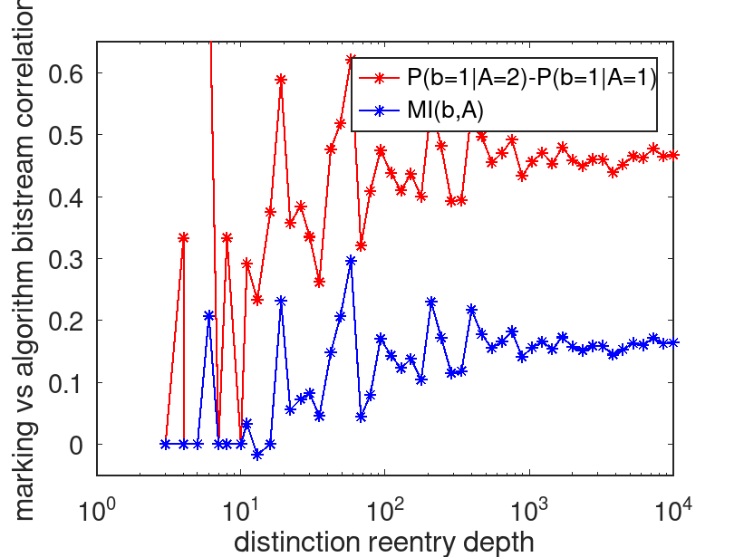

**A minimal numeric model of "ego": no information beyond mutual information**

The GNU-Octave/Matlab code below is a numeric simulation of a minimal (2 bit: present and past binary state) model of "ego" built from outcomes of marking stochastically-appearing past distinctions (randomly chosen between two logical algorithms, ie a 1-bit channel); see balanced mean(b)\~0.5 in figure. The main salient is that, despite the fact that 1. any information in ego bitstream history is endogenous (constraint-generated) and not referential/semantic, and 2. distinction choice is purely stochastic, **"mutual information" (MI)** between the two is evident both in naive correlation \[probability of ego state given algorithm appearance P(b, given A=2)-P(b, given A=1)\] *and* using the formal definition of MI. This clearly shows that "meaning" is never absolute and always context-specific -- there is no way to isolate a "you" separate from the whole containing all distinctions and their marks.

This model is simple enough that a 4-state Markov chain (yielding an arithmetic expression to calculate MI\~0.34998...) can be found. The algorithms used, based on AND and OR, are natively realized in spiking neuron networks (with only \~5 neurons) due to integration and threshold selection by the external distinction bit, and provides a minimal mechanism for learning. NOR/NAND are also valid choices — you are invited to try variations.

```
function ego_minimal()

close all

% Octave-compatible seeding (optional)

rand("seed", sum(100*clock));

% --- number of distinctions ---

Ns = round(logspace(1, 3, 51));

% --- throw away transient for analysis ---

burn_frac = 0.2;

for k = 1:numel(Ns)

N = Ns(k);

burn = floor(burn_frac * N);

% --- random initial 2-bit state ---

b_prev = (rand < 0.5);

b_curr = (rand < 0.5);

% --- initialize algorithm choice record ---

As = zeros(1, N);

% --- initialize "ego" bitstream record ---

bs = false(1, N);

% --- iterate through N random distinctions ---

for t = 1:N

% --- choose algorithm randomly ---

if rand < 0.5

A = 1;

out = A1(b_prev, b_curr);

else

A = 2;

out = A2(b_prev, b_curr);

end

As(t) = A;

bs(t) = out;

% --- shift to retain last two "ego" bits for next distinction ---

b_prev = b_curr;

b_curr = out;

end

% --- remove transient ---

As2 = As(burn+1:end);

b2 = bs(burn+1:end);

% --- correlation analysis ---

p1 = mean(b2(As2==1));

p2 = mean(b2(As2==2));

C(k) = p2 - p1;

I(k) = mi_A_B(As2, b2);

mb2(k)=mean(b2);

fprintf("N=%d mean(b)=%.4f p1=%.4f p2=%.4f C=%.4f I=%.4f bits\n", N, mb2(k), p1, p2, C(k), I(k));

end

fprintf("\n Analytic targets:\n");

fprintf("mean(b)=0.5 p1=%.6f p2=%.6f C=%.6f I=0.34998 bits\n", 1/6, 5/6, 2/3);

plot(Ns, mb2, Ns, C, Ns, I)

legend('mean(b)','P(b|A=2)-P(b|A=1)','MI(b,A)')

set(gca,'fontsize',14,'ytick',[0.34998 0.5], 'xlabel', '# of distinctions', 'ylabel', 'bits/probability')

end

function out = A1(x, y)

out = (~x) & y;

end

function out = A2(x, y)

out = (~x) | y;

end

function I = mi_A_B(A, b)

C = zeros(2,2);

for t = 1:numel(A)

C(A(t), b(t)+1) = C(A(t), b(t)+1) + 1;

end

Pab = C / sum(C(:));

Pa = sum(Pab,2);

Pb = sum(Pab,1);

I = 0;

for a=1:2

for bb=1:2

if Pab(a,bb) > 0

I = I + Pab(a,bb) * log2(Pab(a,bb) / (Pa(a)\*Pb(bb)));

end

end

end

end
```


