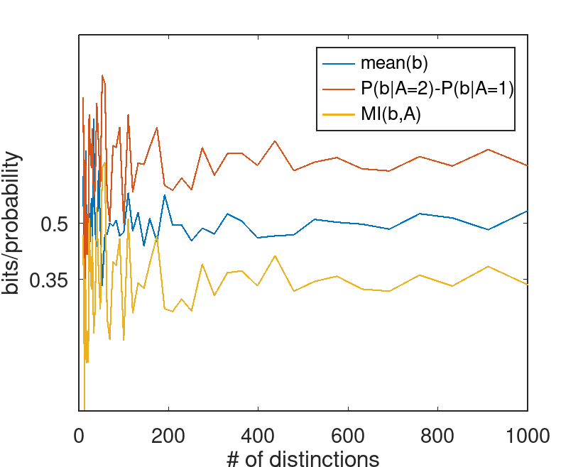
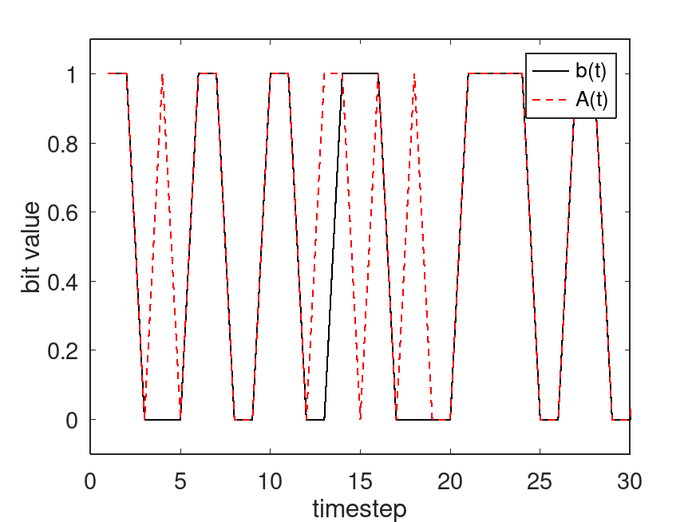

**A minimal numeric model of "ego": no information beyond mutual information**

Before reading, please see the (philosophical motivation)[model-of-spontaneous-ego-formation.md] for this numerical model. 

The GNU-Octave/Matlab code below is a numeric simulation of a minimal (2 bit: present and past binary state) model of "ego" built from outcomes of marking stochastically-appearing past distinctions (randomly chosen between two logical algorithms, ie a 1-bit channel); see balanced mean(b)\~0.5 in figure. The main salient is that, despite the fact that 1. any information in ego bitstream history is endogenous (constraint-generated) and not referential/semantic, and 2. distinction choice is purely stochastic, **"mutual information" (MI)** between the two is evident both in naive correlation \[probability of ego state given algorithm appearance P(b, given A=2)-P(b, given A=1)\] *and* using the formal definition of MI. This clearly shows that "meaning" is never absolute and always context-specific -- there is no way to isolate a "you" separate from the whole containing all distinctions and their marks.

This model is simple enough that a 4-state Markov chain (yielding an arithmetic expression to calculate MI\~0.34998...) can be found. The algorithms used, based on AND and OR, are natively realized in spiking neuron networks (with only \~5 neurons) due to integration and threshold selection by the external distinction bit, and provides a minimal mechanism for learning. NOR/NAND are also valid choices — you are invited to try variations.

Mutual information calculated empirically using an unbiased stochastic input matches the Markov value \~0.35: 



Illustration of how the internal logical constraints on bitstream transitions tends to reproduce the input stochastic variable resulting in mutual information:



```matlab
function ego_minimal()
  close all

  % Octave-compatible seeding (optional)
  rand("seed", sum(100*clock));

  % --- number of distinctions ---
  Ns = round(logspace(1, 3, 51));

  % --- throw away transient for analysis ---
  burn_frac = 0.2;

  for k = 1:numel(Ns)

    N = Ns(k);
    burn = floor(burn_frac * N);

    % --- random initial 2-bit state ---
    b_prev = (rand < 0.5);
    b_curr = (rand < 0.5);

    % --- initialize algorithm choice record ---
    As = zeros(1, N);
    % --- initialize "ego" bitstream record ---
    bs = false(1, N);

    % --- iterate through N random distinctions ---
    for t = 1:N
      % --- choose algorithm randomly ---
      if rand < 0.5
        A = 1;
        out = A1(b_prev, b_curr);
      else
        A = 2;
        out = A2(b_prev, b_curr);
      end

      As(t) = A;
      bs(t) = out;

     % --- shift to retain last two "ego" bits for next distinction ---
      b_prev = b_curr;
      b_curr = out;
    end

    % --- remove transient ---
    As2 = As(burn+1:end);
    b2  = bs(burn+1:end);

    % --- correlation analysis ---
    p1 = mean(b2(As2==1));
    p2 = mean(b2(As2==2));
    C(k)  = p2 - p1;
    I(k)  = mi_A_B(As2, b2);

    mb2(k)=mean(b2);
    fprintf("N=%d  mean(b)=%.4f  p1=%.4f  p2=%.4f  C=%.4f  I=%.4f bits\n", N, mb2(k), p1, p2, C(k), I(k));

  end

  fprintf("\nAnalytic targets:\n");
  fprintf("mean(b)=0.5  p1=%.6f  p2=%.6f  C=%.6f  I=0.34998 bits\n", 1/6, 5/6, 2/3);

  figure(1)
  plot(Ns, mb2, Ns, abs(C), Ns, I)
  legend('mean(b)','P(b|A=2)-P(b|A=1)','MI(b,A)')
  set(gca,'fontsize',14,'ytick',[0.34998 0.5], 'xlabel', '# of distinctions', 'ylabel', 'bits/probability')

  figure(2)
  ptail=30;
  plot(1:(ptail+1), bs((end-ptail):end), 'k', 1:(ptail+1), As((end-ptail):end)-1, 'r--')
  legend('b(t)','A(t)')
  set(gca,'fontsize',14,'ylim',[-0.1 1.1], 'xlim', [0 ptail], 'xlabel', 'timestep', 'ylabel', 'bit value')

end


function out = A1(x, y)
  out = (~x) & y;
end

function out = A2(x, y)
  out = (~x) | y;
end


function I = mi_A_B(A, b)

  C = zeros(2,2);

  for t = 1:numel(A)
    C(A(t), b(t)+1) = C(A(t), b(t)+1) + 1;
  end

  Pab = C / sum(C(:));
  Pa = sum(Pab,2);
  Pb = sum(Pab,1);

  I = 0;

  for a=1:2
    for bb=1:2
      if Pab(a,bb) > 0
        I = I + Pab(a,bb) * log2(Pab(a,bb) / (Pa(a)*Pb(bb)));
      end
    end
  end

end
```

# Markov model

With a 2-bit memory the system is a 4-state Markov chain, which allows a fully analytic approach with a closed-form expression for mutual information:

## Setup (minimal 2-bit system)

Let the internal state at time $t$ be the last two marks

$$
(x,y) = (b_{t-1}, b_t)
$$

and choose $A_t \in \{1,2\}$ uniformly at random each step.

Define the update rules:

**A1:**

$$
b_{t+1} = (\neg x) \wedge y
$$

**A2:**

$$
b_{t+1} = (\neg x) \vee y
$$

The next state is then

$$
(y, b_{t+1})
$$

---

## Stationary distribution over internal states

Label the four states as $00, 01, 10, 11$.  
The induced transition matrix is:

$$
P =
\begin{pmatrix}
0.5 & 0.5 & 0   & 0 \\
0   & 0   & 0   & 1 \\
1   & 0   & 0   & 0 \\
0   & 0   & 0.5 & 0.5
\end{pmatrix}
$$

Solving $\pi = \pi P$ yields normalized left-eigenvector:

$$
\pi(00) = \frac{1}{3}, \quad
\pi(01) = \frac{1}{6}, \quad
\pi(10) = \frac{1}{6}, \quad
\pi(11) = \frac{1}{3}.
$$

---

## Marginal unbiased output

Using the stationary distribution and equal rule choice:

$$
P(b_{t+1}=1) = 0.5
$$

So the output bitstream is unbiased.

---

## Conditional separation

Define

$$
p_1 = P(b_{t+1}=1 \mid A1), \quad
p_2 = P(b_{t+1}=1 \mid A2)
$$

Under A1, output is 1 only in state 01:

$$
p_1 = \frac{1}{6}
$$

Under A2, output is 0 only in state 10:

$$
p_2 = \frac{5}{6}
$$

Hence

$$
C = p_2 - p_1 = \frac{2}{3}
$$

---

## Joint distribution

## Joint distribution

|      | b = 0   | b = 1   |
|------|---------|---------|
| A1   | 5/12    | 1/12    |
| A2   | 1/12    | 5/12    |

---

## Mutual information

$MI(A;b) = \sum_{a,b} P(a,b)\log_2 \frac{P(a,b)}{P(a)P(b)} =
\frac{5}{6}\log_2\left(\frac{5}{3}\right)
+
\frac{1}{6}\log_2\left(\frac{1}{3}\right)
=0.3499776$ bits $\approx 0.35$ bits

---

Thus the system has:

$$
\text{mean}(b) = 0.5, \quad
p_1 = \frac{1}{6}, \quad
p_2 = \frac{5}{6}, \quad
MI(A;b) \approx 0.35 \text{ bits}
$$
