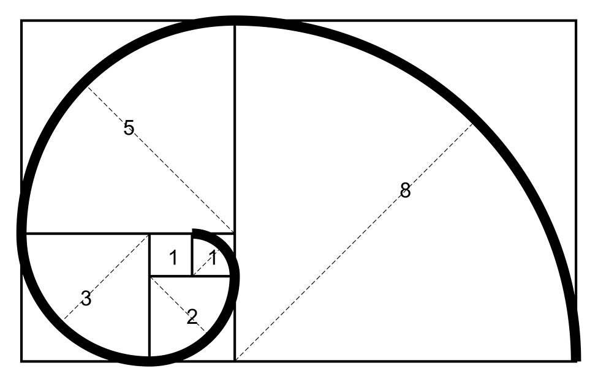

**Scale invariance in patterns of distinction as structural forgetting of the first mark**

The activity of mind can be understood, in its most elementary form, as the act of drawing distinctions and marking one side. A distinction divides what was previously undivided into two sides: a marked region and an unmarked region. This operation is simple but profound, because once a distinction is made, attention can move to one side of it and treat that side as something definite.

This movement (returning attention to the marked side and drawing another distinction within it ) is called *re-entry*. The operation is repeated: mark, then re-enter the marked side and mark again. In this way, distinctions accumulate. Structure appears.

As an analogy for the action of mind, this process is remarkably suggestive. Experience is continually segmented into objects, categories, memories, and expectations. Each new distinction is built within the context created by earlier ones. Thought unfolds as a chain of marks drawn inside previous marks.

To visualize the structural consequences of such a process, imagine beginning with a simple linear distinction in a plane. A region is marked. The next distinction must occur within that marked region *while still preserving the previous structure*. If this process is continued while maintaining geometric consistency with an asymptotic full tiling of the plane, the sizes of successive regions must follow a recurrence relation involving at least two previous scales; the simplest linear relation is:

S\_{n+1} = S\_{n-1}-S\_{n}.

This recurrence is precisely the Fibonacci rule. \[However, because we are fracturing the field into smaller spaces, this rule corresponds to recursive descent rather than the more familiar ascent generating the sequence 1,1,2,3,5,…\]

Following the successively marked spaces traces the familiar Fibonacci spiral, which approaches the *logarithmic spiral,*

r=A\\exp{-b\\theta} (in polar coordinates),

as the sequence continues. In this way, a simple rule (repeatedly marking one side of distinctions within the marked side) produces a recognizable geometric form.

The spiral that emerges has several remarkable properties.

First, it exhibits self-similar descent. Each turn of the spiral resembles every other turn; the entire curve can be enlarged or reduced and it will still coincide with itself. This property is called *scale invariance*. Mathematically, scaling the spiral by a constant factor simply moves one along the curve. Enlargement is equivalent to rotation.

Second, because of this invariance, the spiral possesses no intrinsic beginning. Any point along the curve can serve as the apparent starting point if the coordinate system is chosen there. Locally, the structure looks the same everywhere. There is no feature within the curve itself that reveals where the first turn occurred.

These properties have an interesting implication for the analogy with mind.

Once the process of marking begins, and each distinction generates another within the marked side, the resulting structure acquires the character of the spiral: self-similar, continuous, and without an identifiable origin from within its own structure. Every moment appears to arise from previous moments. Every distinction seems to be the consequence of earlier distinctions.

Thus the system develops the appearance of historical continuity. From within the process, it seems as though the structure must always have been unfolding in this way. The original act of marking (the moment that first divided the undivided) becomes *structurally invisible*.

In this sense, the spiral can be understood as a self-maintaining illusion of continuity. Its persistence requires only that the process of marking continue. Each new distinction sustains the appearance of a continuous curve extending indefinitely forward and backward.

Yet the spiral has no independent existence apart from this activity. It is not an object separate from the act that generates it. The curve appears only as long as the drawing continues.

The analogy therefore reveals something subtle about the structure of illusion. The apparent continuity of the spiral does not arise because the curve contains a beginning hidden somewhere along its length. Rather, the structure itself is such that no point within it can display the origin of the process that generated it.

The beginning is obscured not by concealment *but by symmetry.*

And so the spiral, sustained by ongoing marking, appears endless. It gives the impression of a world that has always been unfolding. But its continuity is maintained only by the continuation of the very operation that produces it: the repeated drawing of distinctions within distinctions.

In this way, the geometry of the Fibonacci spiral offers a simple model for how a process of recursive distinction can generate a stable, self-similar structure that conceals its own beginning while it is being maintained. The illusion persists as long as the drawing continues.

------------

The scale invariant property of this geometric construction provides a striking structural analogy to the Buddhist understanding of Saṃsāra, the cycle of conditioned existence. In Buddhist doctrine, saṃsāra is described as beginningless (anādi). The tradition repeatedly emphasizes that the origin of the cycle cannot be discovered by tracing events backward in time. Every moment arises in dependence on previous conditions, as articulated in the doctrine of Dependent Origination (pratītyasamutpāda). Because each link in this chain arises from prior links (ie every effect becomes a cause), the search for a first moment within the chain itself cannot succeed.

Importantly, Buddhist doctrine does not propose liberation by discovering the first cause of saṃsāra. Instead, liberation arises when the recursive process ceases. When ignorance and craving no longer generate further conditions, the cycle of dependent origination comes to an end. This cessation is called Nirvāṇa.

--------

TL;DR:

Pure re-entry is the ground, prior to all marks.

A distinction is marked, and with it the possibility of recursive continuation via reentry.

In a plane, stable recursive continuation takes the form of Fibonacci growth and thus the logarithmic spiral.

Because the spiral is scale-invariant, it has no locally recoverable beginning.

Therefore recursive marking generates a self-maintaining illusion of continuity.

Mind, as ordinarily experienced, is participation in that continuation.

Freedom is not tracing the curve back to its first turn, but ceasing to draw it.

—

The ordinary world of selves, histories, and unfolding continuity is not built from substantial entities. It is the visible trace of marking maintaining itself. And because the trace is scale-invariant, it cannot reveal, from within itself, that it ever began.

-------------

The spiral model assumes that each distinction is structurally identical to the previous one. Ordinary memory does not satisfy this condition; its distinctions vary in content and scale, continually perturbing the recursion. But one distinction may approximate this invariance: the boundary between observer and observed. Each act of perception reinstates this division, and the mind re-enters it continuously. In that sense the repeated marking of “I observing” may constitute a minimal recursive structure whose self-similar character conceals any identifiable beginning.

------------

Notice that the equation defining the golden ratio (asymptotic growth of Fibonacci sequence)

\phi = 1 + \frac{1}{\phi}

is itself a self-reference equation. In a sense, the golden ratio is the simplest numerical fixed point of recursive reentry.

--------

