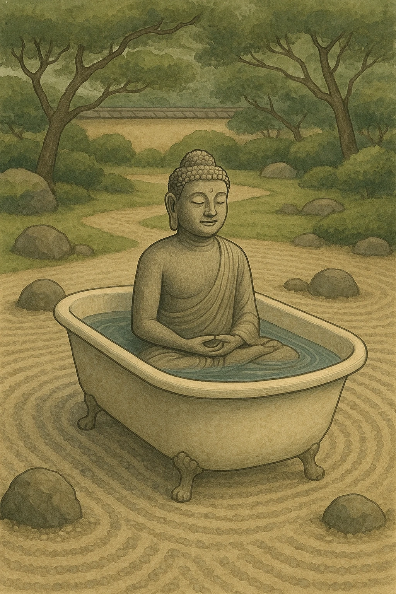

**The clear waters of knowing**

``` 
The ultimate truth of the human condition is simple: 
you are stuck in your own bath water.
To hate is sin — akusala, an ignorant incompetence in the basic perception of reality —
for the imagined hater must bear the weight of his own hatred,
clouding his vision, fouling the waters in which he must perpetually bathe. 

The punishment for this sin lies not in any hereafter, but here, now, in the hating itself:
the pain of withdrawing from your natural state of pure love,
of turning your back on the simplicity of “God,”
of insisting on constraints to your own freedom and then identifying with them in the same breath.

But if this ultimate truth is so simple,
why can’t I see it — undo it — myself?

Ah… once this pattern of resistance to the reality of the senses begins,
the latch of the devil is set —
but the gates of Hell are always locked from the *inside*.

You want to be reborn without the burden of the one who suffers,
yet you refuse to let that self die.
So you trap yourself — clutching what would free you
if only you opened your hand.

You cling to your suffering, call it you.
So how could you ever be free of it?
Let go not of pain, but of the one who claims it—
the imagined sufferer, all your righteousness, born only of belief.

This is how we suffer, and how we deny ourselves:
by resisting the very movement that we are.
We are death and rebirth, the pulse of change itself,
a perpetual paradox, ungraspable by mind — 
one, whole, and ever-dying in each moment,
a burning bush, forever aflame and yet never consumed. 

“For whoever wants to save their life will lose it,
but whoever loses their life for the sake of Truth will find it.”

Truth here is not a name, not a creed, not the possession of anyone.
It is the still current beneath all forms,
the silent law by which every self is made and unmade.
To lose your life for Truth’s sake
is simply to stop pretending it was ever yours.

And in that surrender,
life ceases to be something you *have* —
it becomes what you *are*.

```

